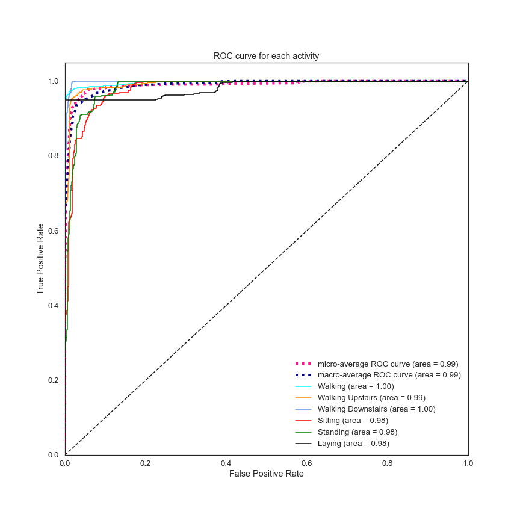

# CNN-LSTM Model for Human Activity Recognition

Human Activity Recognition (HAR) from smartphone sensors signal dataset from [UCI Machine Learning Repositry](https://archive.ics.uci.edu/ml/machine-learning-databases/00240/UCI%20HAR%20Dataset.names)
The goal is to classify the type of movement amongst six activities:
- Walking
- Walking Upstairs
- Walking Downstairs
- Sitting
- Standing
- Laying

## Dataset

The link below shows a video of the 6 activities recorded in the experiment with one of the participants:

  
  <a href="https://youtu.be/XOEN9W05_4A">
[Watch video]
</a>

### Description

> The sensor signals (accelerometer and gyroscope) were pre-processed by applying noise filters and then sampled in fixed-width sliding windows of 2.56 sec and 50% overlap (128 readings/window). The sensor acceleration signal, which has gravitational and body motion components, was separated using a Butterworth low-pass filter into body acceleration and gravity. The gravitational force is assumed to have only low frequency components, therefore a filter with 0.3 Hz cutoff frequency was used.

The almost raw data will be used: only the gravity effect has been filtered out of the accelerometer as a preprocessing step for another 3D feature.

### Overview

The dataset is a recording of 30 people's smartphone signal while performing the different aforementioned activities.
Each of the 3 signals (Body Acceleration, Angular Velocity, Total Acceleration) are recorded as 3-axial (xyz) data points.

There are 10,299 observations within the dataset, with training and test set split at 70% / 30%.

## Data Visualisation

The [EDA.ipynb](EDA.ipynb) workbook contains the code to produce all the visualisation in this section.

### Lineplot of Signals for Each Activity

Simple lineplot for each activity was produced:

Standing vs Walking
    

This is a misrepresentation of the xyz axial data being separated as different lines, therefore 3D plot is produced instead.

### 3D plot of Signal

Body Acceleration: Standing vs Walking

  
   

The above 3D plot is difficult to interpret and human eyes cannot distinguish when the observation starts and ends. A treatment of the 3-axial data to calculate the distance of the data point at each timesteps from the origin (x,y,z=0,0,0)

### Lineplot of Signal Distance to Origin

Body Acceleration: Standing vs Walking

  
   

The above graphs can clearly present the notable difference in pattern between the different activities.

## Model
The [Model.ipynb](Model.ipynb) workbook contains the code for the model and its performance evaluation.

The CNN-LSTM model was trained with data directly feeding into the neural network without feature engineering.

GridSearchCV was used for hyperparameter tuning, and EarlyStopping was applied on the final model.

For the sake of replicability of the code, random seed was set at 17.
    
The original model constructed for the project was conducted without the random seed to be set, the decision on the model to proceed with was based on a repetition of 10 trials per model to obtain the accuracy average. Results from the original will be shared in the below section. This will be displayed under the "ORIGINAL" section.

### Training
The training accuracy and loss curve suggest possibilities of overfit.

### Final Model

    Model: "sequential"

    Layer (type)                  Output Shape          Param #
    time_distributed (TimeDistri  (None, None, 30, 64)  1792
    time_distributed_1 (TimeDist  (None, None, 15, 64)  0
    time_distributed_2 (TimeDist  (None, None, 13, 128) 24704
    time_distributed_3 (TimeDist  (None, None, 6, 128)  0
    time_distributed_4 (TimeDist  (None, None, 4, 256)  98560
    time_distributed_5 (TimeDist  (None, None, 2, 256)  0
    dropout (Dropout)             (None, None, 2, 256)  0
    time_distributed_6 (TimeDist  (None, None, 512)     0
    lstm (LSTM)                   (None, 100)           245200
    dropout_1 (Dropout)           (None, 100)           0
    dense (Dense)                 (None, 100)           10100
    dense_1 (Dense)               (None, 6)             606
    Total params: 380,962 
    Trainable params: 380,962
    Non-trainable params: 0

## Results

### Multi-class Confusion Matrix

There are numerous observations of Walking Downstairs being identified by the model as Walking Upstairs, upon examining these cases, it was found that the signals between those false predictions share very similar visual pattern on the signal distance to origin plots.

### Performance Matrix

           precision          recall  f1-score  support

           Walking            1.0000  0.9497    0.9742    537
           Walking Upstairs   0.7844  0.8819    0.8303    491
           Walking Downstairs 0.9213  0.7707    0.8393    532
           Sitting            0.9979  0.9798    0.9888    496
           Standing           0.9859  0.9976    0.9917    420
           Laying             0.8902  0.9979    0.9409    471
           accuracy                             0.9257    2947
           macro avg          0.9300  0.9296    0.9275    2947
           weighted avg       0.9300  0.9257    0.9255    2947

### ROC AUC

## Conclusion

Overall, the CNN-LTSM model performed well at 93% accuracy and 99% ROC AUC. For improvements, other parameters and structure should be examined to minimize chances of overfit and loss during validation.

## References

The [dataset](https://archive.ics.uci.edu/ml/datasets/Human+Activity+Recognition+Using+Smartphones) can be found on the UCI Machine Learning Repository:

> Davide Anguita, Alessandro Ghio, Luca Oneto, Xavier Parra and Jorge L. Reyes-Ortiz. A Public Domain Dataset for Human Activity Recognition Using Smartphones. 21th European Symposium on Artificial Neural Networks, Computational Intelligence and Machine Learning, ESANN 2013. Bruges, Belgium 24-26 April 2013.

## Afterwords

This is my final project for the Ironhack Data Analytics bootcamp, the presentation has won the data analytics category at the Ironhack Hackshow Paris August 2020.

  
  <a href="https://ironhack.zoom.us/rec/share/7JxQLbHy3DtIT6fkq0r9f5wYGKe9X6a8gXMWrPsLxEgOztkzkZT6OitgEewzcP5X?startTime=1597680785000">
[Watch video at 00:31:10]
</a>

I would like to extend my gratitude to my tutor [Eldiias](https://github.com/Eldiias/) who has helped me in the understanding of the Neural Networks.

### Contact Me

- [LinkedIn](www.linkedin.com/in/sylvianclee)
- [GitHub](https://github.com/nclee17/)
